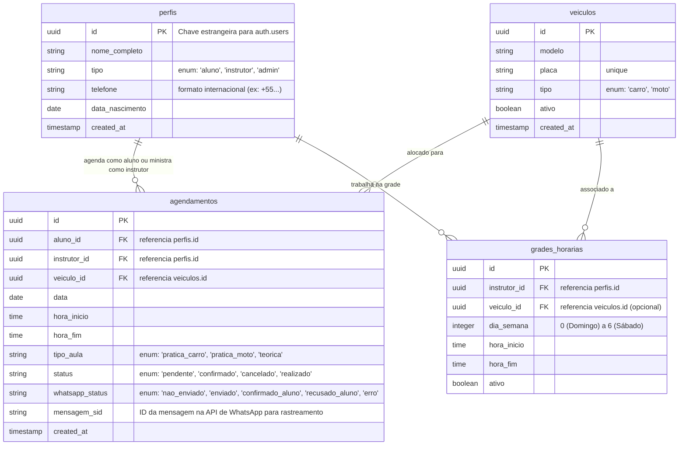
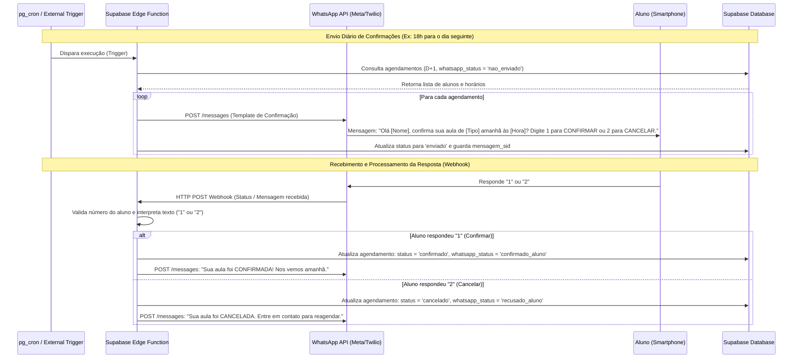

# DOCUMENTACAO_ARQUITETURA.md

Este documento serve como a especificação de arquitetura e o plano de desenvolvimento para o **Sistema de Agendamento e Confirmação de Aulas** da Autoescola. Ele detalha os objetivos do sistema, o esquema do banco de dados, o fluxo de comunicação automatizada via WhatsApp e o roadmap para o desenvolvimento passo a passo.

---

## 1. Objetivo do Sistema

O sistema tem como finalidade otimizar o gerenciamento de agendamentos de aulas práticas e teóricas de uma autoescola, além de reduzir drasticamente a taxa de ausência dos alunos por meio de uma integração automatizada com a API do WhatsApp.

### Funcionalidades Principais:
- **Autenticação e Perfis**: Acesso segmentado para Alunos, Instrutores e Administradores.
- **Gestão de Grade Horária**: Cadastro de horários disponíveis de instrutores e veículos.
- **Painel de Agendamentos**: Interface amigável para reserva, cancelamento e visualização de aulas.
- **Confirmação Automatizada via WhatsApp**: Envio de mensagens de confirmação no dia anterior à aula e processamento de respostas do aluno em tempo real para atualização do status da aula.

---

## 2. Stack Tecnológica Definida

- **Frontend**: React (iniciado com Vite) com TypeScript e Tailwind CSS (para uma UI moderna, responsiva e de alta performance).
- **Backend & Database**: Supabase (PostgreSQL) utilizando recursos de Auth, Row Level Security (RLS), Edge Functions (para Webhooks) e Realtime.
- **Hospedagem & Deploy**: Vercel (Frontend) integrada ao GitHub para CI/CD automático.
- **Integração de WhatsApp**: WhatsApp Cloud API (Meta) ou Twilio para envio/recebimento de mensagens.

---

## 3. Estrutura do Banco de Dados (Supabase / PostgreSQL)

Recomendamos uma modelagem relacional robusta com integridade referencial, utilizando UUIDs como chaves primárias e aplicando políticas de segurança por linha (RLS) para proteger os dados.



### Script SQL de Inicialização Sugerido (DDL)

```sql
-- Habilitar extensões necessárias se aplicável
create extension if not exists "uuid-ossp";

-- 1. Tabela de Perfis (perfis)
create table public.perfis (
    id uuid references auth.users on delete cascade primary key,
    nome_completo text not null,
    tipo text not null check (tipo in ('aluno', 'instrutor', 'admin')),
    telefone text not null,
    data_nascimento date,
    created_at timestamp with time zone default timezone('utc'::text, now()) not null
);

-- 2. Tabela de Veículos (veiculos)
create table public.veiculos (
    id uuid default uuid_generate_v4() primary key,
    modelo text not null,
    placa text not null unique,
    tipo text not null check (tipo in ('carro', 'moto')),
    ativo boolean default true not null,
    created_at timestamp with time zone default timezone('utc'::text, now()) not null
);

-- 3. Tabela de Grades Horárias (grades_horarias)
create table public.grades_horarias (
    id uuid default uuid_generate_v4() primary key,
    instrutor_id uuid references public.perfis(id) on delete cascade not null,
    veiculo_id uuid references public.veiculos(id) on delete set null,
    dia_semana integer not null check (dia_semana between 0 and 6),
    hora_inicio time not null,
    hora_fim time not null,
    ativo boolean default true not null
);

-- 4. Tabela de Agendamentos (agendamentos)
create table public.agendamentos (
    id uuid default uuid_generate_v4() primary key,
    aluno_id uuid references public.perfis(id) on delete cascade not null,
    instrutor_id uuid references public.perfis(id) on delete cascade not null,
    veiculo_id uuid references public.veiculos(id) on delete set null,
    data date not null,
    hora_inicio time not null,
    hora_fim time not null,
    tipo_aula text not null check (tipo_aula in ('pratica_carro', 'pratica_moto', 'teorica')),
    status text default 'pendente' not null check (status in ('pendente', 'confirmado', 'cancelado', 'realizado')),
    whatsapp_status text default 'nao_enviado' not null check (whatsapp_status in ('nao_enviado', 'enviado', 'confirmado_aluno', 'recusado_aluno', 'erro')),
    mensagem_sid text,
    created_at timestamp with time zone default timezone('utc'::text, now()) not null
);

-- Configuração básica de RLS (Row Level Security)
alter table public.perfis enable row level security;
alter table public.veiculos enable row level security;
alter table public.grades_horarias enable row level security;
alter table public.agendamentos enable row level security;
```

---

## 4. Fluxo de Confirmação via WhatsApp

O core da automação é composto por um ciclo fechado que notifica o aluno de maneira proativa e atualiza os registros do Supabase a partir da resposta.

### Diagrama de Sequência do Fluxo



---

## 5. Roadmap de Desenvolvimento Passo a Passo

Propomos uma jornada iterativa dividida em 4 passos lógicos para garantir estabilidade, segurança e qualidade de código.

### **Passo 1: Configuração da Infraestrutura e Supabase**
- [ ] Criação do projeto no Supabase Dashboard.
- [ ] Execução das queries DDL para criação das tabelas no editor SQL.
- [ ] Criação do trigger no PostgreSQL para sincronizar `auth.users` com `public.perfis` após o sign-up.
- [ ] Configuração de políticas de segurança (RLS) básicas:
  - Usuários leem seus próprios perfis.
  - Alunos enxergam apenas seus agendamentos.
  - Admins têm acesso total.
- [ ] Inserção de dados de teste (Seeds) para veículos, perfis de teste e grades horárias.

### **Passo 2: Frontend Base com React, Rotas e Autenticação**
- [ ] Criação do projeto React usando **Vite** e TypeScript.
- [ ] Instalação de dependências principais (`@supabase/supabase-js`, `lucide-react`, `react-router-dom`).
- [ ] Definição do sistema de design global (CSS Premium: gradientes sutis, cantos arredondados, micro-interações, layout responsivo e moderno).
- [ ] Implementação do serviço do Supabase Client.
- [ ] Criação das páginas/componentes de autenticação:
  - Login (E-mail/Senha).
  - Cadastro de Aluno.
  - Recuperação de senha.
- [ ] Configuração do router e das rotas protegidas (Auth Guards).

### **Passo 3: Dashboards de Usuários e Fluxos de Agendamento**
- [ ] **Visão do Aluno**:
  - Dashboard mostrando a próxima aula agendada e progresso de aulas concluídas.
  - Tela de "Novo Agendamento" listando dias disponíveis e horários livres de instrutores/veículos.
  - Histórico de aulas.
- [ ] **Visão do Instrutor**:
  - Agenda diária e semanal com indicação de alunos confirmados.
  - Botão de confirmação de presença (conclusão da aula).
- [ ] **Visão do Administrador**:
  - Painel geral de métricas (número de aulas, taxa de cancelamento, ocupação dos veículos).
  - CRUD de Veículos.
  - CRUD de Instrutores (associando à grade horária).
  - Monitor de Agendamentos globais com filtro por status do WhatsApp.

### **Passo 4: Integração com WhatsApp API, Webhooks e Notificações Realtime**
- [ ] Criação do sandbox/ambiente na API do WhatsApp (ex: WhatsApp Cloud API ou Twilio).
- [ ] Desenvolvimento de uma **Supabase Edge Function** (`whatsapp-webhook`):
  - Handler GET: Validação de Token de verificação exigido pela API do WhatsApp.
  - Handler POST: Recepção de mensagens recebidas.
- [ ] Desenvolvimento do script/função que seleciona aulas de amanhã e dispara os templates de mensagem do WhatsApp.
- [ ] Acoplamento do Webhook de resposta com a atualização das colunas `status` e `whatsapp_status` no banco de dados.
- [ ] Integração do Supabase Realtime no Frontend para atualizar instantaneamente o status do agendamento nos dashboards administrativos sem recarregar a tela.
- [ ] Testes de ponta a ponta e preparação para Deploy em Produção (Vercel).
